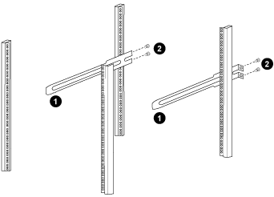

= Installare gli switch Cisco Nexus 9336C-FX2 e 9336C-FX2-T in un cabinet NetApp
:allow-uri-read: 
:icons: font
:imagesdir: ../media/

[role="lead"]
A seconda della configurazione, potrebbe essere necessario installare lo switch Cisco Nexus 9336C-FX2 e 9336C-FX2-T e il pannello pass-through in un cabinet NetApp . Le staffe standard sono incluse con l'interruttore.

.Prima di iniziare
Assicurati di avere quanto segue:

* Il kit del pannello passante è disponibile presso NetApp (codice articolo X8784-R6).
+
Il kit del pannello pass-through NetApp contiene il seguente hardware:

+
** Un pannello cieco passante
** Quattro viti 10-32 x .75
** Quattro dadi a clip 10-32

* Per ogni switch, otto viti 10-32 o 12-24 e dadi a clip per montare le staffe e le guide scorrevoli sui montanti anteriori e posteriori del mobile.
* Kit di guide standard Cisco per installare lo switch in un cabinet NetApp .

NOTE: I cavi di collegamento non sono inclusi nel kit pass-through e dovrebbero essere inclusi con gli switch.  Se non sono stati spediti con gli switch, è possibile ordinarli da NetApp (codice articolo X1558A-R6).

* Per i requisiti di preparazione iniziale, il contenuto del kit e le precauzioni di sicurezza, vedere https://www.cisco.com/c/en/us/td/docs/switches/datacenter/nexus9000/hw/aci_9336cfx2_hig/guide/b_n9336cFX2_aci_hardware_installation_guide.html["Guida all'installazione dell'hardware Cisco Nexus serie 9000"^] .

.Passi
. Installare il pannello cieco passante nell'armadio NetApp .
+
.. Determinare la posizione verticale degli interruttori e del pannello cieco nell'armadio.
+
In questa procedura, il pannello cieco viene installato in U40.

.. Installare due dadi a clip su ciascun lato nei fori quadrati appropriati per le guide anteriori del mobile.
.. Centrare il pannello verticalmente per evitare intrusioni nello spazio rack adiacente, quindi serrare le viti.
.. Inserire i connettori femmina di entrambi i cavi jumper da 48 pollici dalla parte posteriore del pannello e attraverso il gruppo spazzole.
+
image::../media/cisco_9148_jumper_cords.gif[]

+
_(1) Connettore femmina del cavo di collegamento._

. Installare le staffe di montaggio su rack sullo chassis dello switch Nexus 9336C-FX2.
+
.. Posizionare una staffa di montaggio su rack anteriore su un lato del telaio dello switch in modo che l'aletta di montaggio sia allineata con la piastra frontale del telaio (sul lato dell'alimentatore o della ventola), quindi utilizzare quattro viti M4 per fissare la staffa al telaio.
+
image::../media/3132q_front_bracket.gif[staffa anteriore]

.. Ripetere il passaggio 2a con l'altra staffa di montaggio su rack anteriore sull'altro lato dello switch.
.. Installare la staffa di montaggio posteriore sul telaio dello switch.
.. Ripetere il passaggio 2c con l'altra staffa di montaggio su rack posteriore sull'altro lato dello switch.

. Installare i dadi a clip nelle posizioni dei fori quadrati per tutti e quattro i pali IEA.
+
image::../media/ru_locations_for_3132q_v.gif[]

+
I due switch 9336C-FX2 e 9336C-FX2-T sono sempre montati nella parte superiore 2U del cabinet RU41 e 42.

. Installare le guide scorrevoli nel mobile.
+
.. Posizionare la prima guida scorrevole sul segno RU42 sul lato posteriore del montante posteriore sinistro, inserire le viti con il tipo di filettatura corrispondente e quindi serrare le viti con le dita.
+

+
_(1) Mentre fai scorrere delicatamente la guida scorrevole, allineala ai fori delle viti nel rack._

+
_(2) Serrare le viti delle guide scorrevoli ai montanti del mobile._

.. Ripetere il passaggio 4a per il montante posteriore destro.
.. Ripetere i passaggi 4a e 4b nelle posizioni RU41 sull'armadio.

. Installare l'interruttore nell'armadio.
+

NOTE: Per questa operazione sono necessarie due persone: una persona sostiene l'interruttore dalla parte anteriore e un'altra lo guida nelle guide scorrevoli posteriori.

+
.. Posizionare la parte posteriore dell'interruttore su RU41.
+
image::../media/3132q_v_positioning.gif[Posizionamento 3232C a U39-40]

+
_(1) Mentre il telaio viene spinto verso i montanti posteriori, allineare le due guide di montaggio posteriori del rack con le guide scorrevoli._

+
_(2) Far scorrere delicatamente l'interruttore finché le staffe di montaggio sul rack anteriore non sono a filo con i montanti anteriori._

.. Fissare l'interruttore all'armadietto.
+
image::../media/3132q_attaching.gif[]

+
_(1) Mentre una persona tiene in piano la parte anteriore del telaio, l'altra persona deve stringere completamente le quattro viti posteriori ai montanti del mobile._

.. Ora che il telaio è supportato senza assistenza, serrare completamente le viti anteriori ai montanti.
.. Ripetere i passaggi da 5a a 5c per il secondo interruttore nella posizione RU42.
+

NOTE: Utilizzando come supporto l'interruttore completamente installato, non è necessario tenere ferma la parte anteriore del secondo interruttore durante il processo di installazione.

. Una volta installati gli interruttori, collegare i cavi di collegamento alle prese di alimentazione degli interruttori.
. Collegare le spine maschio di entrambi i cavi di collegamento alle prese PDU più vicine disponibili.
+

NOTE: Per mantenere la ridondanza, i due cavi devono essere collegati a PDU diverse.

. Collegare la porta di gestione su ogni switch 9336C-FX2 e 9336C-FX2-T a uno degli switch di gestione (se ordinati) oppure collegarli direttamente alla rete di gestione.
+
La porta di gestione è la porta in alto a destra situata sul lato PSU dello switch. Dopo l'installazione degli switch, il cavo CAT6 di ogni switch deve essere instradato attraverso il pannello passante per connettersi agli switch di gestione o alla rete di gestione.

.Cosa succederà ora?
Dopo aver installato gli switch nell'armadio NetApp , è possibilelink:setup-switch-9336c-cluster.html["configurare gli switch Cisco Nexus 9336C-FX2 e 9336C-FX2-T"] .
